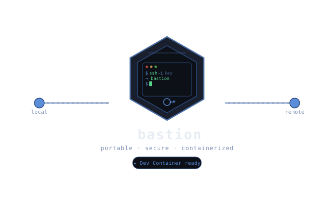

<div align="center">
  
</div>


[日本語版はこちら](README.ja.md)

A CLI tool for SSH host management and file synchronization via a `bastion.json` configuration file.

## Install with curl

The latest release is downloaded automatically and installed into `/usr/local/bin`.

```bash
curl -fsSL https://raw.githubusercontent.com/taka1156/bastion/master/scripts/install.sh | bash
```

To change the install destination:

```bash
curl -fsSL https://raw.githubusercontent.com/taka1156/bastion/master/scripts/install.sh | INSTALL_DIR=$HOME/.local/bin bash
```

After installation, `bsn` is also available as a shortcut alias for `bastion`.

## Architecture

- Domain: rules and models
  - `internal/domain/entity`
- App: composition and orchestration
  - `internal/app`
- Input adapters (CLI/JSON)
  - `internal/input`
- Infra (SSH session, SFTP/rsync, file writing)
  - `internal/infra/ssh`
  - `internal/infra/sftp`
  - `internal/infra/filewriter`
- Workflows (use cases)
  - `internal/workflow/initialize`
  - `internal/workflow/ssh`
  - `internal/workflow/rsync`
- Entry point: CLI
  - `cmd/bastion`

Dependencies only point inward.

## Usage

### Initialize bastion.json

Run the `init` subcommand to generate a `bastion.json` template.

```bash
bastion init
```

| Option | Default | Description |
|---|---|---|
| `-output` | `.` | Output directory for `bastion.json` |

### Start an SSH session

```bash
bastion ssh
```

Opens an interactive SSH session to the first host defined in `bastion.json`.

### Sync files via rsync (SFTP)

```bash
bastion rsync -local ./src
```

| Option | Default | Description |
|---|---|---|
| `-local` | `./local` | Local directory to sync to the remote host |

### Show version

```bash
bastion version
```

### Update bastion

```bash
bastion update
```

| Option | Default | Description |
|---|---|---|
| `-lang` | (auto-detect) | Language for CLI messages (`en` or `ja`) |

## bastion.json format

You can attach the JSON Schema in editors that support JSON Schema validation and completion.

```json
{
  "$schema": "./bastion.schema.json",
  "hosts": [
    {
      "name": "production",
      "ip": "xxx.xxx.xxx.xxx",
      "user": "ec2-user",
      "port": 22,
      "key": "key/prod.pem",
      "cloudflare": {
        "use_tunnel": true,
        "tunnel_token": "xxx",
        "subdomain": "prod",
        "domain": "example.com"
      }
    }
  ]
}
```

### Host fields

| Field | Required | Description |
|---|---|---|
| `name` | ✓ | Display name for this host |
| `ip` | ✓ | IP address of the target server |
| `user` | ✓ | SSH login user |
| `port` | | SSH port (default: `22`) |
| `key` | | Path to SSH private key file |
| `cloudflare` | | Cloudflare Tunnel settings (see below) |

### Cloudflare Tunnel fields

| Field | Required | Description |
|---|---|---|
| `use_tunnel` | ✓ | Whether to route SSH through Cloudflare Tunnel |
| `tunnel_token` | | Cloudflare Tunnel token |
| `subdomain` | | Subdomain for the tunnel hostname |
| `domain` | | Domain for the tunnel hostname |

## Development

### Run

```bash
go run ./cmd/bastion
# or
make run
```

### Build

```bash
make build
```

### Test

```bash
make test
```

### Cross-platform distribution

```bash
make dist
```

Generates binaries under `dist/` for the following targets:

- `bastion_linux_amd64.tar.gz`
- `bastion_linux_arm64.tar.gz`
- `bastion_darwin_amd64.tar.gz`
- `bastion_darwin_arm64.tar.gz`
- `bastion_windows_amd64.exe`

## License

MIT
